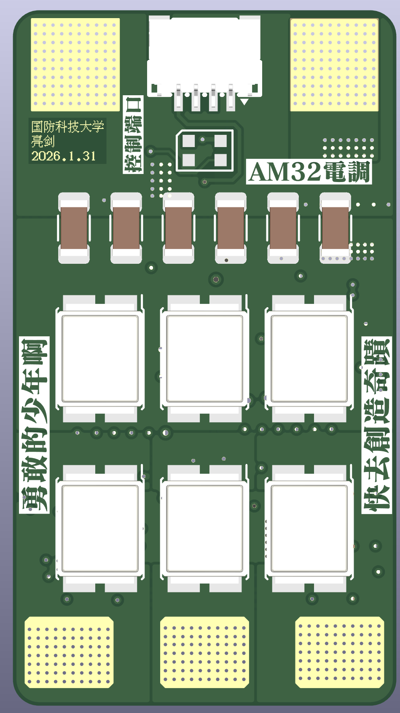
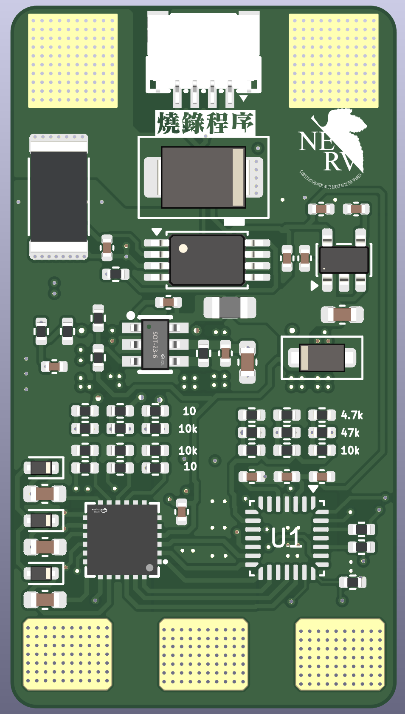
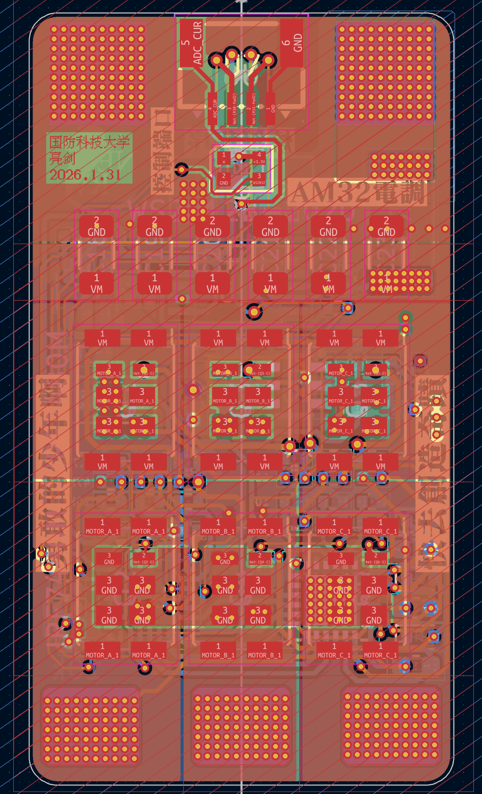
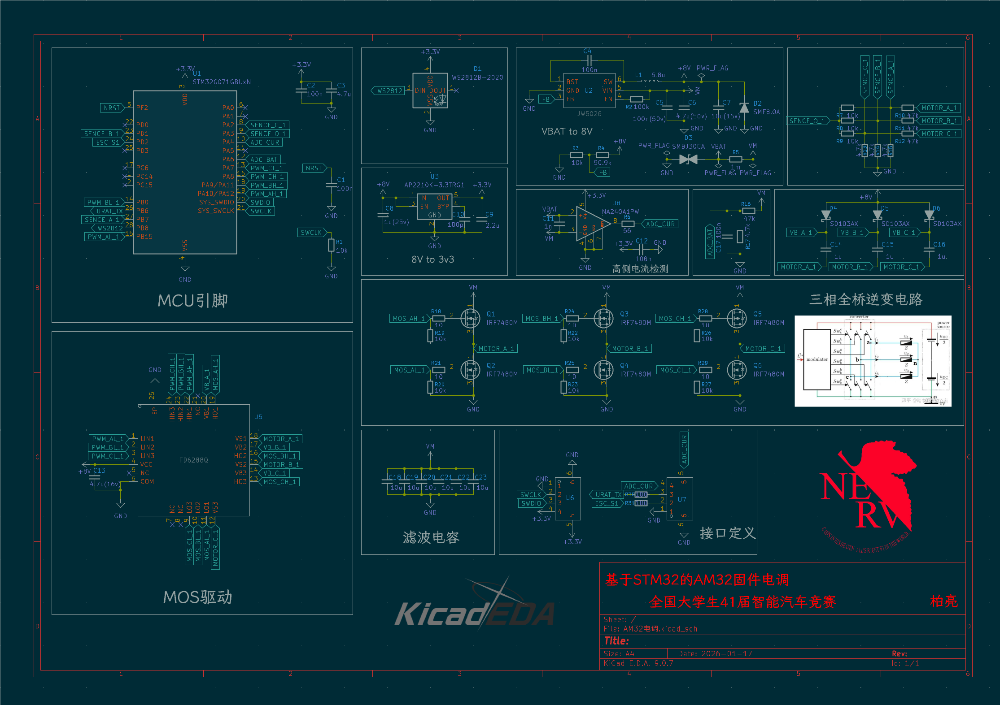

<!--
 * @Author: BaiLiang
 * @Date: 2026-01-17 11:20:38
 * @LastEditTime: 2026-02-01 10:15:56
 * @Description: 
-->

# AM32 开源电调 (STM32G071 版)

本项目是一款基于 **AM32** 开源固件的高性能无刷电调（ESC）。专为“全国大学生智能汽车竞赛”及高频动力系统设计，采用高集成度方案，支持大电流输出与精准的电流控制。

 

## 🚀 项目特性

- **核心处理器**: STM32G071GBU6N，ARM Cortex-M0+ 内核，高性能且具有极佳的性价比。
- **驱动芯片**: FD6288Q 三相半桥驱动，成熟稳定。
- **功率 MOSFET**: IRF7480M DirectFET 封装，极低导通内阻（RDSon），散热效率极高。
- **电流检测**: 搭载 **INA240A1** 高侧/线电流检测放大器，提供极高精度的电流反馈，支持精准的电流限幅和力矩控制。
- **电源管理**:
    - **JW5026** Buck 电路将电池电压转换为 8V（驱动电压）。
    - **AP2210K** LDO 提供 3.3V 给 MCU 和逻辑电路。
- **状态指示**: 集成 **WS2812B** RGB 灯珠，可根据电调状态切换颜色。
- **接口**:
    - 标准 SWD 调试接口。
    - 支持 PWM/DShot 信号输入。
    - 支持 UART 异步通信（用于电调配置或遥测）。

## 🛠 硬件规格

| 参数 | 规格 |
| :--- | :--- |
| **输入电压** | 2S - 4S LiPo (根据电容与 Buck 电路限制) |
| **持续电流** | 建议 40A+ (取决于 PCB 散热) |
| **固件** | AM32 (Multi-Protocol BLDC) |
| **PCB 层数** | 2/4 层 (建议使用 2oz 铜厚) |
| **设计软件** | KiCad 9.0.7 |

## 📂 硬件连接定义 (引脚映射)

根据原理图设计，关键引脚定义如下（编译 AM32 固件时需参考）：

- **PWM 输入 (Signal)**: `PA2` (ESC_S1)
- **电感/相电压感测**: `PA3 (SENCE_O_1)`, `PD1 (SENCE_B_1)`, `PB7 (SENCE_A_1)`
- **电流检测 (Current)**: `PA4 (ADC_CUR)`
- **电压检测 (V-Bat)**: `PA1 (ADC_BAT)`
- **驱动控制 (Gate Drivers)**:
    - Phase A: `PA10 (H)`, `PB15 (L)`
    - Phase B: `PA9 (H)`, `PB14 (L)`
    - Phase C: `PA8 (H)`, `PB13 (L)`
- **RGB LED**: `PB8 (WS2812)`

## 💾 固件烧录与配置

本项目运行 **AM32** 开源固件。

1.  **固件源码/下载**:
    - AM32 官方 GitHub: [https://github.com/am32-esc/AM32](https://github.com/am32-esc/AM32)
    - 预编译固件下载: [AM32 Releases](https://github.com/am32-esc/AM32/releases)
2.  **配置工具**:
    - 建议使用官方在线配置器: [https://configurator.am32.ca/](https://configurator.am32.ca/)
3.  **烧录方式**:
    - 初次烧录：通过 ST-Link 连接板载 SWD 接口，使用 `STM32CubeProgrammer` 烧录 Bootloader。
    - 后续升级：可通过信号线进行串口升级。

## ⚠️ 免责声明

- 本项目为开源硬件，DIY 存在风险。在焊接和通电测试前，请务必检查电路是否存在短路。
- 建议初次通电时使用限流电源，以防止 MOSFET 烧毁。
- 作者不对使用本设计造成的任何直接或间接损失负责。

## 📜 许可协议

本项目硬件方案基于 [CERN Open Hardware Licence](https://ohwr.org/project/cernohl/wikis/Documents/CERN-OHL-version-2) 或 MIT 协议开源。固件部分遵循 AM32 原作者的 GPL v3 协议。

---
**设计者**: 柏亮 (Bailiang)
**所属单位**: 全国大学生41届智能汽车竞赛国防科技大学